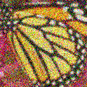
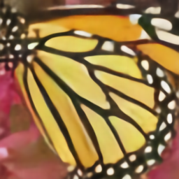
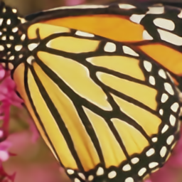
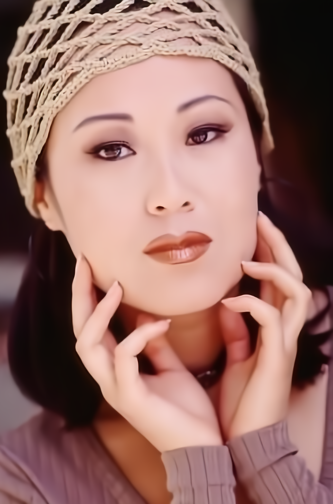
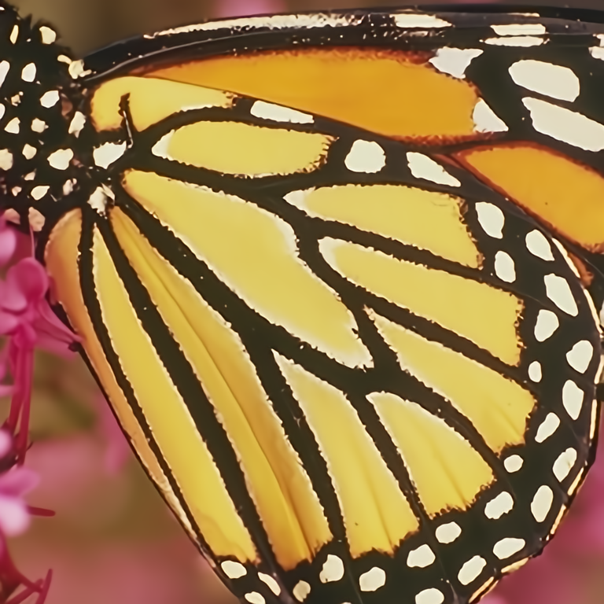

# Learning a Single Convolutional Super-Resolution Network for Multiple Degradations

# Abstract
Recent years have witnessed the unprecedented success of deep convolutional neural networks (CNNs) in single image super-resolution (SISR). However, existing CNN-based SISR methods mostly assume that a low-resolution (LR) image is bicubicly downsampled from a high-resolution (HR) image, thus inevitably giving rise to poor performance when the true degradation does not follow this assumption. Moreover, they lack scalability in learning a single model to deal with multiple degradations. To address these issues, we propose a dimensionality stretching strategy that enables a single convolutional super-resolution network to take two key factors of the SISR degradation process, i.e., blur kernel and noise level, as input. Consequently, the proposed super-resolver can handle multiple and even spatially variant degradations, which significantly improves the practicability. Extensive experimental results on synthetic and real LR images show that the proposed convolutional super-resolution network not only can produce favorable results on multiple degradations but also is computationally efficient, providing a highly effective and scalable solution to practical SISR applications.

# Network Architecture

In contrast to other CNN-based SISR methods which only take the LR image as input and lack scalability to handle other degradations, 
the proposed network takes the concatenated LR image and degradation maps as input, thus allowing a single model to manipulate multiple 
and even spatially variant degradations.


# SISR Results
## Bicubic Degradation


## General Degradation
The left is the LR image with isotropic Gaussian blur and noise level 50, the right is the super-resolved image by SRMD with scale factor 2.

 

The left is the LR image with isotropic Gaussian blur and noise level 5, the right is the super-resolved image by SRMD with scale factor 3.

 

The left is the LR image with anisotropic Gaussian blur, the right is the super-resolved image by SRMD with scale factor 4.
 


## Real Image SR


Super-resolved image by VDSR with scale factor 3.
 

Super-resolved image by SRMD with scale factor 3.


Super-resolved image by VDSR with scale factor 3.
 

Super-resolved image by SRMD with scale factor 3.



# SRMD models

- Bicubic Degradation
```
 `Demo_bicubic_degradation_SRMD.m` is the testing demo of SRMD for the widely-used bicubic degradation.
 `Demo_bicubic_degradation_SRMDNF.m` is the testing demo of SRMDNF for the widely-used bicubic degradation.
```


- General Degradation
```
 `Demo_genearal_degradation_SRMD.m` is the testing demo of SRMD for the general degradation.
 `Demo_genearal_degradation_SRMDNF.m` is the testing demo of SRMDNF for the general degradation.
```

- Real Application
```
 `Demo_real_application_SRMD.m` is the testing demo of SRMD for real image SR.
```

- Others
```
 `Demo_degradation_direct_SRMD.m` is the testing demo of SRMD for another widely-used degradation with direct downsampler.
 `Demo_degradation_direct_SRMDNF.m` is the testing demo of SRMD for another widely-used degradation with direct downsampler.
 
  A special case of SRMD when scale factor is 1.
 `Demo_denoising_and_deblurring_gray_SRMD.m` is the testing demo of SRMD for grayscale image denoising and deblurring.
 `Demo_denoising_and_deblurring_color_SRMD.m` is the testing demo of SRMD for for color image denoising and deblurring.
 `Demo_real_application_denoising_and_deblurring_gray.m` is the testing demo of SRMD for real grayscale image denoising and deblurring.
 `Demo_real_application_denoising_and_deblurring_color.m` is the testing demo of SRMD for real color image denoising and deblurring.
```

# Requirements and Dependencies
- MATLAB R2015b
- [Cuda](https://developer.nvidia.com/cuda-toolkit-archive)-8.0 & [cuDNN](https://developer.nvidia.com/cudnn) v-5.1
- [MatConvNet](http://www.vlfeat.org/matconvnet/)

 or

- MATLAB R2015b 
```
Use `res = vl_srmd_matlab(net, input)` instead.
```


